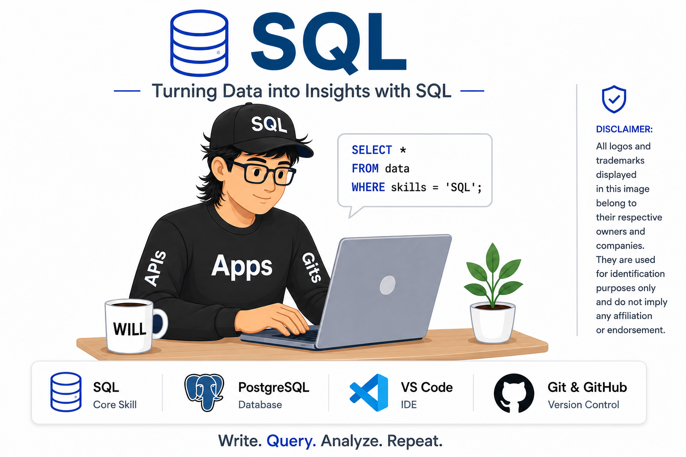

# SQL Data Analyst Job Market Analysis

<p align="center">
  
</p>

## 📖 Overview

This project explores the 2023 Data Analyst job market using SQL to uncover salary trends, identify the most sought-after skills, and determine which skills offer the greatest career value. The analysis is based on real-world job posting data and demonstrates practical SQL techniques for extracting business insights.

---

## 🛠️ Tech Stack

- SQL
- PostgreSQL
- Visual Studio Code
- Git & GitHub

---

## 📊 Key Findings

- 💰 Identified the highest-paying Data Analyst positions
- 📈 Discovered the most in-demand technical skills
- 🧠 Analyzed the skills associated with top-paying jobs
- 💵 Ranked skills based on average salary
- 🚀 Highlighted the best skills by balancing demand and earning potential

---

## 📂 Project Structure

```text
project_sql/
├── 1_top_paying_jobs.sql
├── 2_top_paying_job_skills.sql
├── 3_in_demand_skills.sql
├── 4_top_paying_skills.sql
├── 5_optimal_skills.sql
└── README.md
```

## 📖 Summary
This project demonstrates SQL querying, joins, CTEs, aggregations, and data analysis to extract meaningful insights from real-world job market data.